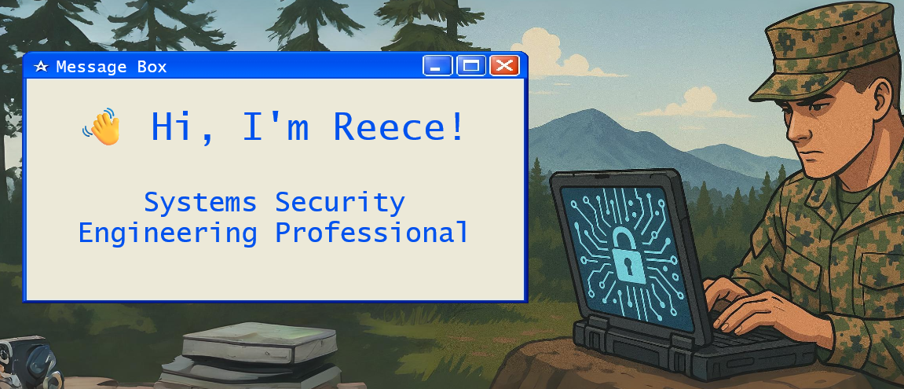

  

Lockheed Martin Information Systems Security Engineering | Obsessed with automation, compliance, and secure systems development

  
  
  

### 📌 Featured Projects

- [**reeceniemuth.com**](https://reeceniemuth.com)  
  *My Professional Landing Page.*

- [**Cyber Portfolio**](https://github.com/ReeceNiemuth/Cyber-Engineering-Portfolio)  
  *A highlight page for some of my professional projects and development efforts*

- [**Home Lab ISSE Collection**](https://github.com/ReeceNiemuth/HomeLab-ISSE-Collection-PUBLIC)  
  *Codebase, configurations, and security documentation from my personal DoD-aligned Home Lab.*

- [**Alternate Codebase (GitLab)**](https://gitlab.com/ReeceNiemuth)  
  *Supplementary projects and code hosted on GitLab.*

---

#### Here's what I bring to the table...

##### 📜 Certifications  

##### 👨‍💻 Programming & Scripting

##### 💻 Operating Systems & Virtualization

##### 🛡️ Security Tools & Frameworks

##### ☁️ Cloud Platforms

##### ⚙️ DevOps & Other Tools

## 🔗 Connections
- [**My Personal Website**](https://reeceniemuth.com) 
- [My LinkedIn Profile](https://www.linkedin.com/in/reece-niemuth-mba-cissp-ccsp-54a87419a/)
- [My Gitlab Profile - Alternate Coding Repo](https://gitlab.com/ReeceNiemuth)
- [My Home Lab Repo](https://github.com/ReeceNiemuth/HomeLab-ISSE-Collection)
- [My SWE-Related Undergraduate Java Projects](https://github.com/ReeceNiemuth/TCU-SWE-Undergrad-Projects)
